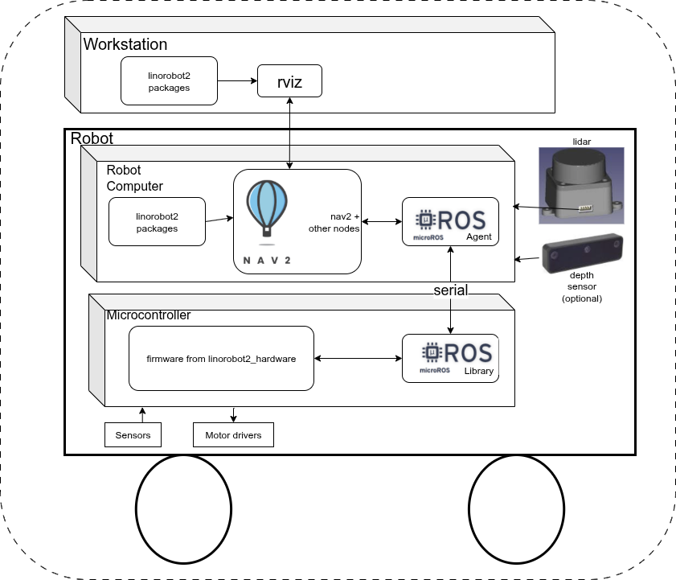
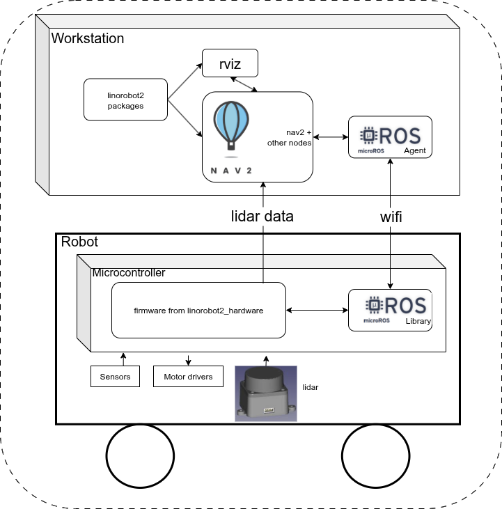
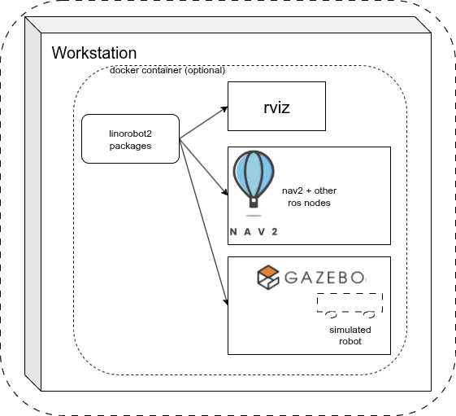

# System Configurations
This page describes the supported system configurations of linorobot2.

## Robot Computer Configuration
This configuration features a linux computer that's mounted on the
robot and which runs ROS nodes and communicates with the microcontroller.
As well, a network-connected workstataion provides for running
rviz and other graphical programs on a desktop while the robot
moves around. The Robot Computer Config is shown below.

Linorobot2 is installed on both the workstation and the robot computer. A
linorobot2 launchfile starts rviz on the workstation, and provides
suitable config files. Other linorobot2 launchfiles on the robot computer
start robot bringup and nav2 and provide suitable config files.

The firmware running on the microcontroller publishes sensor
data to ROS nodes on the robot computer, which enables Nav2
nodes to run SLAM and path planning/navigation algorithms which
in turn publish motion commands to microcontroller firmware. The
firmware runs PID loops and directs motor drivers to move the wheels.

The micro-ROS agent on the robot computer publishes and subscribes
to ROS topics on the robot computer and passes topic messages
to the micro-ROS library, which makes them available to firmware.

High bandwidth sensors like lidar and depth camera are typically
connected directly to the robot computer.

#### Advantages
- Robot navigation may be wholly on the robot, making it independent
of network connectivity

#### Disadvantages
- Robot computer brings extra power requirements, weight and cost

## Robot Wifi Configuration

This configuration supports simple, low hardware cost configurations by
eliminating the robot computer. It features a desktop workstation that
runs the ROS nodes that would otherwise run on a robot computer, as well
as rviz and other graphical programs. The workstation communicates over
wifi with an ESP32 microcontroller on the robot. This config takes
advantage of the micro-ros ability to use either serial
or wifi links. The Robot Wifi config is shown below.

As in the previous config, the firmware running on the microcontroller
publishes sensor data to ROS nodes on the workstation, which enables
Nav2 nodes to run SLAM and path planning/navigation algorithms which in
turn publish motion commands to microcontroller firmware. The firmware
runs PID loops and directs motor drivers to move the wheels.

The micro-ROS agent on the robot computer publishes and subscribes to
ROS topics on the robot computer and passes topic messages over a wifi
UDP connection to the micro-ROS library, which makes them available
to firmware.

The lidar sensor data is passed directly from the serial port of the
microcontroller to a wifi UDP port that's separate from the
micro-ros wifi UDP port.

#### Advantages
- Lowest cost configuration eliminates robot computer
- Lower power, weight
- All ROS SW runs on a single workstation that's wifi-UDP connected
to the robot microcontroller - no intercomputer DDS issues

#### Disadvantages
- Only supported on ESP32 microcontrollers
- Limited number of lidar sensors supported by firmware
- Depending on the wifi network, desired frame rate may not be achieved

## Workstation Simulation Configuration

This config runs a gazebo simulation of the robot, Nav2
for navigation, and rviz and other graphical programs on a
workstation. Only packages from the linorobot2 repo are used - the
linorobot2_hardware repo is not involved as there is no hardware.
This config enables development of robot algorithms prior to putting
them on robot hardware. It can optionally be run in a docker
container, meaning the host OS is decoupled from ROS dependencies.
The Simulation config is shown below.

#### Advantages
- Develop and test on a "digital twin" of the real robot
- Test higher-level system components in a repeatable environment
- Eliminate HW-related problems (hardware malfunctions,
need to reposition robot, battery and comms issues, etc.)

#### Disadvantages
- Hardware model fidelity, especially for sensors, limits 
simulation accuracy
- The ultimate goal is to run on a real robot; simulation can only
be a step on the path to that goal

## Cloud Simulation Configuration

This config runs a gazebo simulation of the robot, Nav2
for navigation, and rviz and other graphical programs in a
Docker instance on a virtual computer in the cloud.
Only packages from the linorobot2 repo are used - the
linorobot2_hardware repo is not involved as there is no hardware.
This config enables development of robot algorithms prior to putting
them on robot hardware.
The Simulation config is shown below.

#### Advantages
- Same as Workstation simulation
- You can rent higher-performance configurations (e.g. many NVidia GPUs)
to speed up simulation

#### Disadvantages
- Same as Workstation simulation
- You typically pay based on cloud CPU usage. May be more or less expensive
than buying a high-end workstation.
- Using virtual KVM over a VPN and setting up NVidia Cuda libraries in the cloud
adds configuration complexity